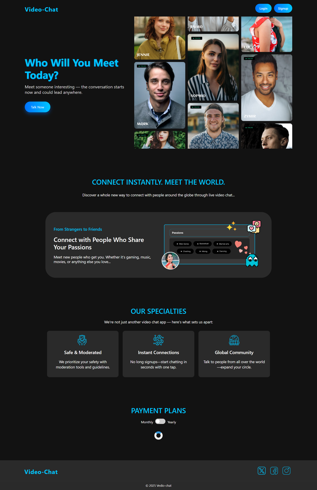
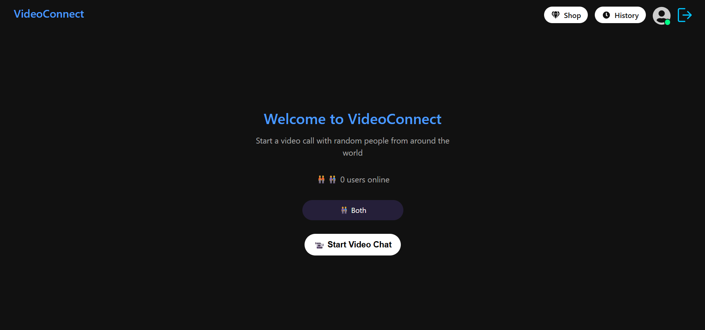
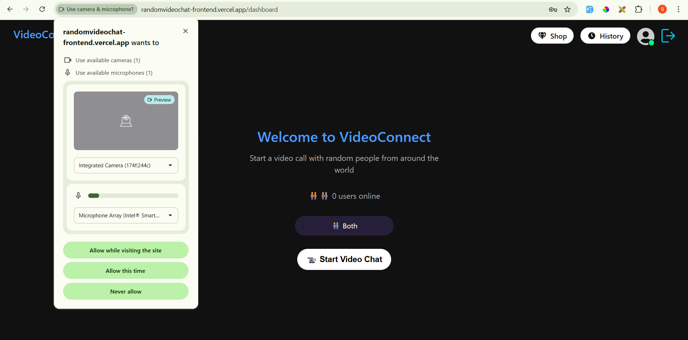
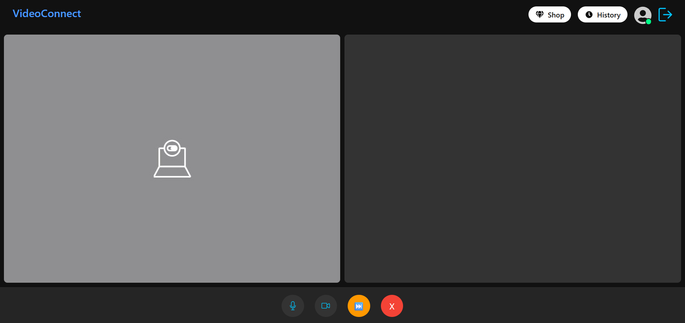

# VideoChat--React-Python-Node-JS

📖 Overview
This is a real-time video calling application that allows users to connect instantly using peer-to-peer WebRTC technology. The frontend is built with React, the WebRTC signaling server is implemented in Node.js, and Python handles the backend APIs for authentication, user management, and other application logic.

🚀 Features
🎥 One-to-one video calls in real time

🔄 Random user matching or room-based joining

🔒 Secure authentication using Python backend APIs and JWT

📱 Responsive UI for desktop and mobile

🌐 Scalable signaling server with Node.js and WebSocket

🛠️ Tech Stack
Frontend: React, WebRTC, CSS
Signaling Server: Node.js, WebSocket
Backend API: Python
Database: PostgreSQL
Authentication: JWT + Cookies

After Login , We will move to the dashboard.

We will Click on Start Vedio Chat button and it will ask for Microphone and Camera Access.

It will find a best connection for us and we can talk.

Premium Users have some Premium Features ( Choose the Another Person According to Gender , Badge After there Name )

