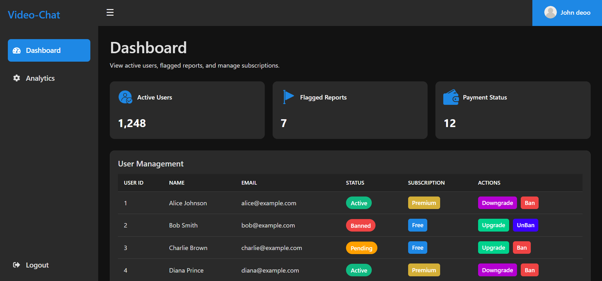

# VideoChat--React-Python-Node-JS

**Live Demo:** [Click Here](https://video-chat-react-python-node-js.vercel.app/)

📖 Overview
This is a real-time video calling application that allows users to connect instantly using peer-to-peer WebRTC technology. The frontend is built with React, the WebRTC signaling server is implemented in Node.js, and Python handles the backend APIs for authentication, user management, and other application logic.

🚀 Features
🎥 One-to-one video calls in real time

🔄 Random user matching or room-based joining

🔒 Secure authentication using Python backend APIs and JWT

📱 Responsive UI for desktop and mobile

🌐 Scalable signaling server with Node.js and WebSocket

🛠️ Tech Stack
Frontend: React, WebRTC, CSS
Signaling Server: Node.js, WebSocket
Backend API: Python
Database: PostgreSQL
Authentication: JWT + Cookies

# Home Page Design

# After Login — Dashboard

# Start Video Chat — Camera & Microphone Access

# Finding Best Connection & Talking

# Admin Dashboard

Premium Users have some Premium Features ( Choose the Another Person According to Gender , Badge After there Name )

